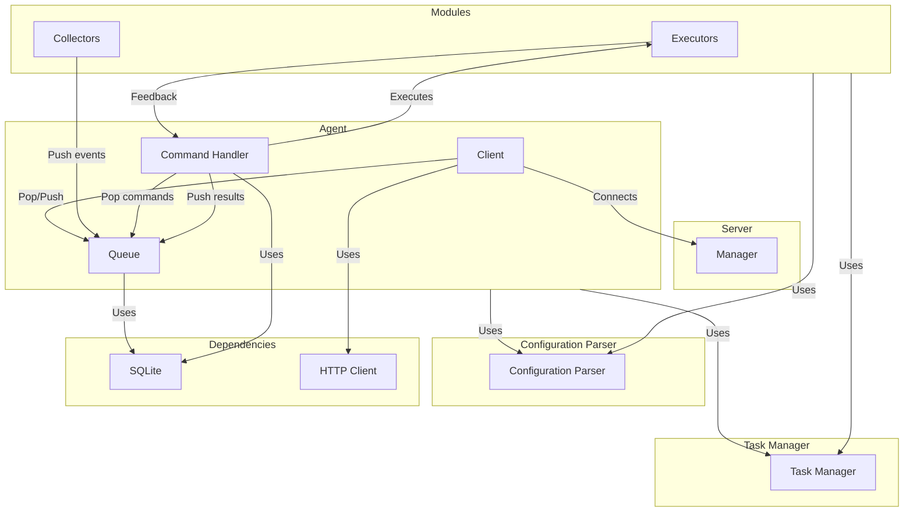
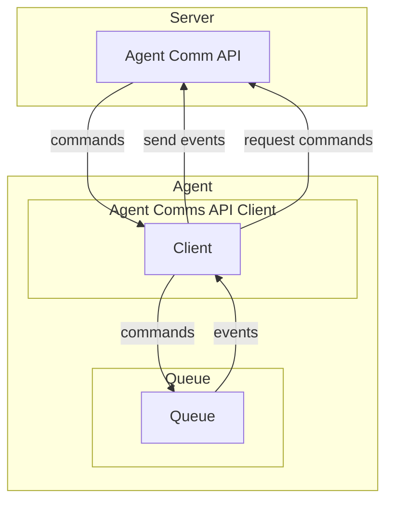
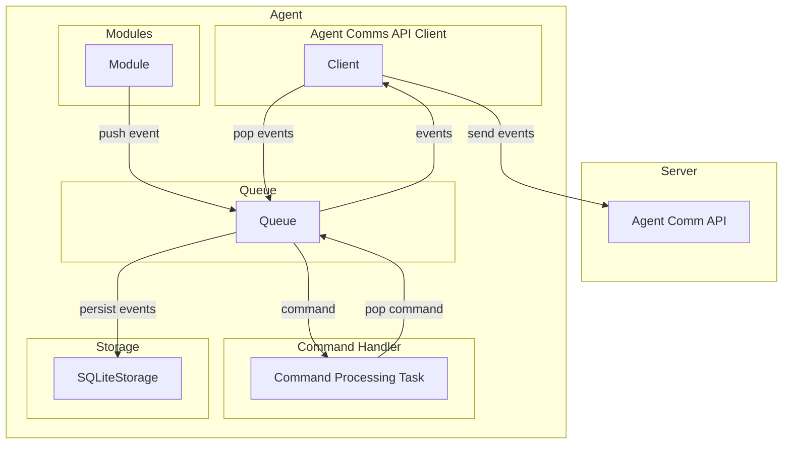
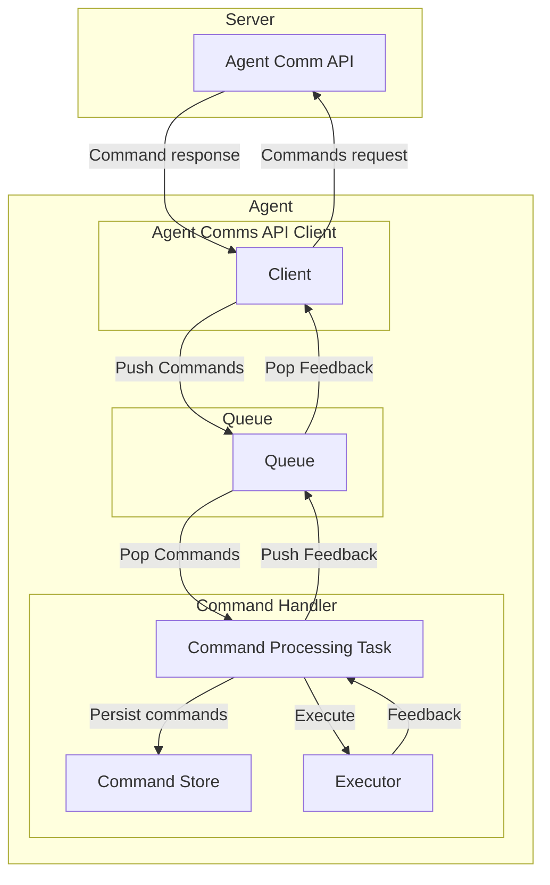

# Architecture

The new Wazuh Agent version features a robust core architecture designed for secure data collection and efficient
communication with the Wazuh Manager. The following component diagram illustrates the agent's core elements and their
interactions.

**Component Overview:**

- **Agent:**
  - **Client:** Acts as the HTTP/2 client that connects and communicates with the Wazuh Manager.
  - **Queue (Storage):** A persistent message queue that temporarily stores data collected by the agent.
  - **Command Handler:** Executes commands received from the Wazuh Manager, facilitating remote management.

- **Configuration Parser:** A parser for loading and retrieving configuration values from YAML files or strings.

- **Task Manager:** Responsible for starting and stopping threads and for scheduling tasks to be executed.

- **Dependencies:**
  - **SQLite:** Used by the Queue and the Command Handler to ensure data persistence and reliable storage.
  - **Http Client:** Responsible for creating and managing all HTTP and HTTPS connections and requests, used by the
  Client.

- **Modules:**
  - **Executors:** Handles operations such as upgrades, manages centralized configuration and active responses to
    security events.
  - **Collectors:** Aggregates various data collection routines, including log collection (for log data analysis), file
    integrity monitoring (FIM), and security configuration assessment (SCA). It also incorporates inventory collection
    functions to gather details on installed packages, hardware, and network configurations.

- **Server:**
  - **Manager:** Represents the Wazuh Manager that receives data from the agent and sends commands back to it.

This architecture emphasizes a clear separation of concerns, where the core agent components work together to deliver
secure and efficient functionality. The modular design also allows for future extensibility, ensuring that new
collectors or other enhancements can be integrated seamlessly.

---

## Client

The **Client** component in the Wazuh Agent architecture is responsible for managing secure and efficient communication
between the agent and the Wazuh Manager. It utilizes HTTP/2 to establish a bidirectional connection, enabling real-time
data exchange. This design ensures that the agent can send logs, events, and other relevant information to the Manager
while receiving commands. The Client implementation follows modern communication standards, ensuring both data integrity
and confidentiality during transmission.

Refer to [Messages](../messages.md) for more details about defined messages.

## Queue

The **Queue** component plays a crucial role in managing the flow of events and commands within the Wazuh Agent. It
acts as an intermediary storage mechanism that ensures efficient handling, persistence, and retrieval of data between
different agent components. The following diagram illustrates its interactions with key system components:

### How It Works

- **Event Handling:**
  - The **Modules** generate events based on system activities and push them into the **Queue**.
  - The **Queue** temporarily stores these events before they are processed.
  - The **Client** component retrieves events from the **Queue** and sends them to the **Agent Comm API Server** for
    further processing.
  - To ensure reliability, events are also persisted in the **SQLiteStorage**, preventing data loss in case of
    disruptions.

- **Command Processing:**
  - The **Command Processing Task** extracts commands from the **Queue** and processes them accordingly.
  - The **Queue** ensures commands are retrieved in a structured manner, preventing loss or duplication.

This architecture guarantees an efficient, fault-tolerant approach to managing event and command flow within the Wazuh
Agent, ensuring responsiveness and reliability.

## Command Handler

The command processing flow in the Wazuh Agent is designed to handle incoming instructions from the server efficiently
and reliably. The following diagram illustrates the main components involved in command management and their
interactions:

### How It Works

- **Command Handler:**
  - The **Command Processing Task** process commands sent from the server extracting them from the queue.
  - It immediately **persists these commands** in the **Command Store**, ensuring that they are reliably stored and not
    lost in case of transient issues.
  - The **Command Processing Task** then forwards the commands to the **Executor**, which is responsible for executing
    the given tasks.
  - Once execution is complete, the **Executor** provides **feedback** back to the **Command Handler**.

- **Agent Comms API Client:**
  - The **Client** component within the Agent Comms API Client initiates a connection to the API server by sending a
    **command request**.
  - The API server responds with the corresponding command, which the Client then stores in the queue.
  - After processing, any feedback from the Command Handler is sent back to the Client, which can then relay it to the
    server if required.

This design ensures a clear separation between command reception, persistence, execution, and feedback. It not only
maintains robustness through persistence (using the Command Store) but also guarantees that the agent remains responsive
to dynamic instructions from the Wazuh Manager.

Refer to [Commands](../commands.md) for more details about defined commands.

---

## Executors

### Centralized Configuration

The Centralized Configuration executor processes the `set-group` and `fetch-config` commands. These commands update the
groups the agent belongs to and request the corresponding configuration from the manager. This ensures that the agent
maintains an up-to-date configuration based on its assigned group settings.

### Restart Handler

The Restart Handler executor processes the `restart` command, allowing the agent to restart itself when required.

**Note**: For more information on these commands, refer to [Commands](../commands.md).

## Collectors

### Inventory

Refer to [Inventory Module](../modules/inventory/README.md) for more details.

### Logcollector

Refer to [Logcollector Module](../modules/logcollector/README.md) for more details.

**Note:** These modules can act as executors as well.
