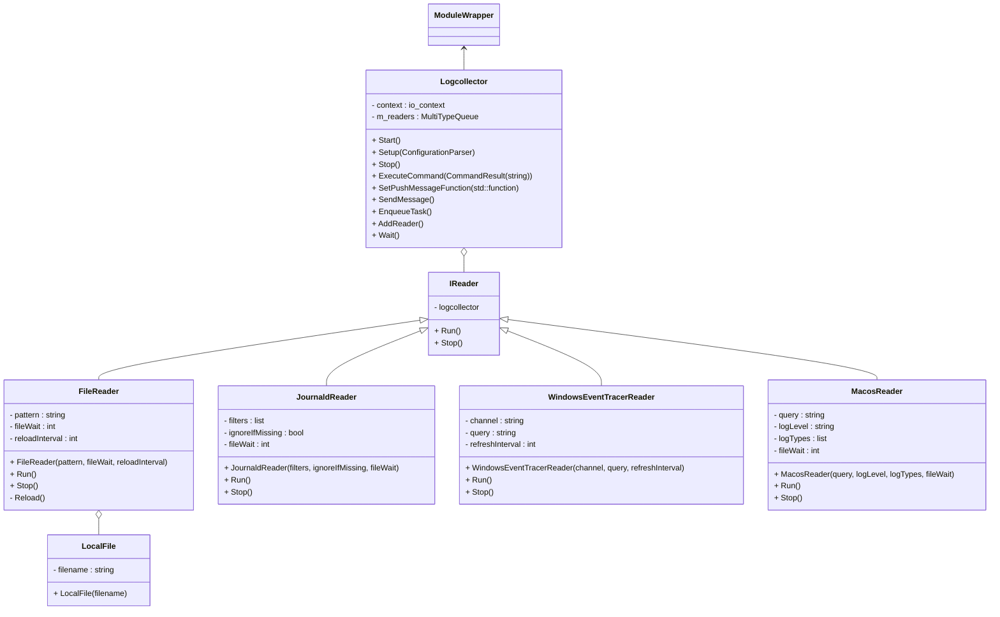

# Logcollector Module

## Introduction

Logcollector is the agent module that adds the ability to collect system logs,
both by reading plain text files and by collecting messages from the operating
system API.

### Reference

|Mandatory|Option|Description|Default|
|:-:|--|--|--|
||`enabled`|Sets the module as enabled|yes|

#### File Collector

```yaml
logcollector:
  enabled: true
  reload_interval: 1m
  file_wait: 500ms
  localfiles:
    - /var/log/auth.log
```

The File collector handles plain-text log files. It needs a file path to work.

|Mandatory|Option|Description|Default|
|:-:|--|--|--|
|| reload_interval | Time in milliseconds to recheck for new files to monitor | 60000 |
|| file_wait | Time in milliseconds to recheck for available logs | 500 |
|✔️| localfiles | Vector of file paths to monitor |  |

#### Journald Collector

```yaml
logcollector:
  enabled: true
  file_wait: 500ms
  journald:
    - field: "_SYSTEMD_UNIT"
      value: "cron.service"
      exact_match: true
      ignore_if_missing: true
    - field: "SYSLOG_IDENTIFIER"
      value: "systemd"
      exact_match: false
      ignore_if_missing: true
    - conditions:
        - field: "_COMM"
          value: "cat"
          exact_match: true
        - field: "PRIORITY"
          value: "3|4"
          exact_match: true
      ignore_if_missing: true
```

This collector gets logs from Journald on Linux. It needs a field and a value to work.

```json
{"agent":{"groups":[],"host":{"architecture":"x86_64","hostname":"HOSTNAME","ip":["LOCALIP","4444:4444:4444:4444:4444:44444:4444:4444","127.0.0.1","::1"],"os":{"name":"Ubuntu 24.01","type":"Unknown","version":"24.04"}},"id":"4444-4444-4444-4444-ae5a7d59936c","name":"","type":"Endpoint","version":"5.0.0"}}
{"module":"logcollector","type":"journald"}
{"event":{"created":"2025-01-17T17:58:26.212Z","module":"logcollector","original":"hello0003","provider":"syslog"},"log":{"file":{"path":"unknown"}},"tags":["mvp"]}
{"module":"logcollector","type":"journald"}
{"event":{"created":"2025-01-17T17:58:32.026Z","module":"logcollector","original":"(CRON) INFO (pidfile fd = 3)","provider":"syslog"},"log":{"file":{"path":"cron.service"}},"tags":["mvp"]}
{"module":"logcollector","type":"journald"}
{"event":{"created":"2025-01-17T17:58:32.110Z","module":"logcollector","original":"Stopping Regular background program processing daemon...","provider":"syslog"},"log":{"file":{"path":"init.scope"}},"tags":["mvp"]}
```

|Mandatory|Option|Description|Default|
|:-:|--|--|--|
|| file_wait | Time in milliseconds to recheck for available logs | 500 |
|✔️| journald | Vector of journald fields to monitor |  |
|✔️| journald.field | Journald field to be monitored |  |
|✔️| journald.value | Value of the Journald field to be filtered by |  |
|| journald.exact_match | Boolean that allows the value setting to be a substring instead of the exact filtering value | true |
|| journald.ignore_if_missing | Boolean to ignore the filtering condition for logs without the specified field | false |
|| journald.conditions | Vector of journald fields to filter to be applied simultaneously |  |

#### Windows Collector

```yaml
logcollector:
  enabled: true
  channel_refresh: 5s
  windows:
    - channel: System
      query: Event[System/EventID = 37]
```

This collector gets logs from the Windows Event Viewer. It needs a channel and a query to work. It will subscribe to the before mentioned channel with the specified query and it will return a json containing the events matching the criteria.

```json
{"agent":{"groups":[],"host":{"architecture":"x86_64","hostname":"HOSTNAME","ip":["LOCALIP","4444:4444:4444:4444:4444:44444:4444:4444","127.0.0.1","::1"],"os":{"name":"Microsoft Windows Server 2022","type":"Unknown","version":"10.0.20348.2762"}},"id":"4444-4444-4444-4444-ae5a7d59936c","name":"","type":"Endpoint","version":"5.0.0"}}
{"module":"logcollector","type":"eventchannel"}
{"event":{"created":"2025-01-07T21:41:27.712Z","module":"logcollector","original":"<Event xmlns='http://schemas.microsoft.com/win/2004/08/events/event'><System><Provider Name='Microsoft-Windows-Time-Service' Guid='{06edcfeb-0fd0-4e53-acca-a6f8bbf81bcb}'/><EventID>37</EventID><Version>0</Version><Level>4</Level><Task>0</Task><Opcode>0</Opcode><Keywords>0x8000000000000000</Keywords><TimeCreated SystemTime='2025-01-07T21:41:26.8876581Z'/><EventRecordID>13597</EventRecordID><Correlation/><Execution ProcessID='12848' ThreadID='14956'/><Channel>System</Channel><Computer>HOSTNAME</Computer><Security UserID='S-1-5-19'/></System><EventData Name='TMP_EVENT_TIME_SOURCE_REACHABLE'><Data Name='TimeSource'>time.windows.com,0x8 (ntp.m|0x8|0.0.0.0:123-&gt;40.444.4.444:444)</Data></EventData></Event>","provider":"syslog"},"log":{"file":{"path":"System"}},"tags":["mvp"]}
```

|Mandatory|Option|Description|Default|
|:-:|--|--|--|
|| channel_refresh | Time in milliseconds to recheck for available logs | 5000 |
|✔️| windows | Vector of readers to subscribe |  |
|✔️| windows.channel | Channel name to be used for subscription |  |
|✔️| windows.query | Query to apply to the channel |  |

#### macOS (ULS) Collector

```yaml
logcollector:
  enabled: true
  file_wait: 500ms
  macos:
    - query: process == "sshd" OR message CONTAINS "invalid"
      level: info
      type: trace,activity,log
```

This collector gets logs from macOS through the Unified Logging System. It needs a query, a level, and a type to work.

```json
{"module":"logcollector","type":"macos"}
{"event":{"created":"2025-01-17T20:40:56.072Z","module":"logcollector","original":"2025-01-17 20:40:55 +0000 Setting mfgr data:<private> len:9 id:4C","provider":"syslog"},"log":{"file":{"path":"macos"}},"tags":["mvp"]}
{"module":"logcollector","type":"macos"}
{"event":{"created":"2025-01-17T20:40:56.072Z","module":"logcollector","original":"2025-01-17 20:40:55 +0000 APSMessageStore - Destroying database.","provider":"syslog"},"log":{"file":{"path":"macos"}},"tags":["mvp"]}
{"module":"logcollector","type":"macos"}
{"event":{"created":"2025-01-17T20:40:56.072Z","module":"logcollector","original":"2025-01-17 20:40:55 +0000 WPDScanManager - Notifying Client About Discovered Device: Client (<private>) - UUID (<private>)","provider":"syslog"},"log":{"file":{"path":"macos"}},"tags":["mvp"]}
{"module":"logcollector","type":"macos"}
{"event":{"created":"2025-01-17T20:40:56.073Z","module":"logcollector","original":"2025-01-17 20:40:55 +0000 Device found changed: CBDevice 555E3FA6-AE3A-412A-6C97-2E7E2A069AD3, BDA 60:06:E3:8F:14:AF, Nm 'Bluetooth Device', DsFl 0x40 < NearbyInfo >, RSSI -44, Ch 37, AdTsMC <28588540497>, AMfD <4c 00 10 05 2c 98 bc 13 ff>, nbIAT <bc 13 ff>, nbIF 0xCA < Ranging AUE AT Duet >, CF 0x200000000 < RSSI >","provider":"syslog"},"log":{"file":{"path":"macos"}},"tags":["mvp"]}
```

|Mandatory|Option|Description|Default|
|:-:|--|--|--|
|| file_wait | Time in milliseconds to recheck for available logs | 500 |
|✔️| macos | Vector of queries to filter macOS logs |  |
|✔️| macos.query | Predicate to filter logs |  |
|✔️| macos.level | Log verbosity level: debug, info, notice, error or fault |  |
|✔️| macos.type | Limits the log type; possible values (combinable): activity, log, trace |  |

## Class Diagram


