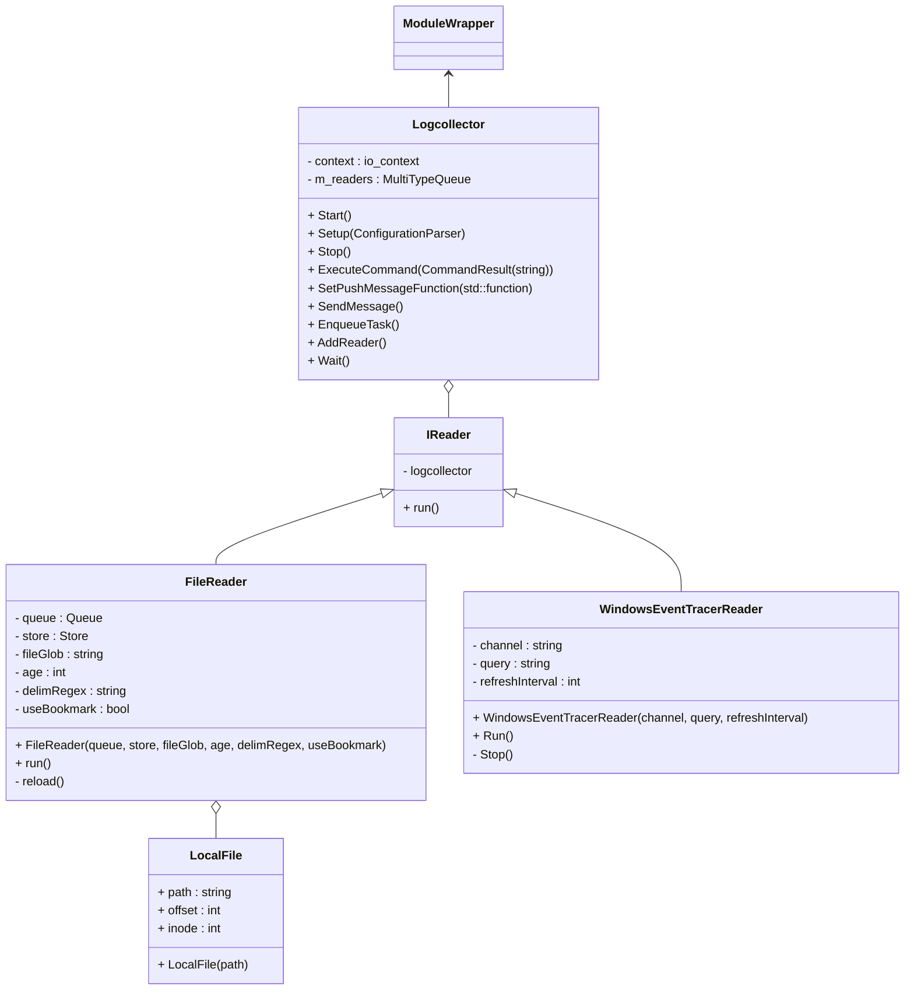

# Logcollector Module

## Introduction

Logcollector is the agent module that adds the ability to collect system logs,
both by reading plain text files and by collecting messages from the operating
system API.


### Reference

|Mandatory|Option|Description|Default|
|:-:|--|--|--|
||`enabled`|Sets the module as enabled.|yes|

#### File Collector

```yaml
- file:
```

The File collector handles plain-text log files.

|Mandatory|Option|Description|Default|
|:-:|--|--|--|
|✔️|`location`|Path to the file. Wildcards are supported.||
||`age`|Collect logs from files more recent than this parameter.|`0`|
||`delim-regex`|Regex to delimit logs within the file.|`\n`|
||`use-bookmark`|Whether the agent should jump to the latest line read on startup.|`yes`|

#### Journald Collector

```yaml
```

This collector gets logs from Journald on Linux.

|Mandatory|Option|Description|Default|
|:-:|--|--|--|

#### Windows Collector

```yaml
logcollector:
  enabled: true
  channel_refresh: 5s
  windows:
    - channel: System
      query: Event[System/EventID = 37]
```

This collector gets logs from the Windows Event Viewer. It needs a channel and a query to work. It will subscribe to the before mentioned channel with the specified query and it will return a json containing the events matching the criteria.

```json
{"agent":{"groups":[],"host":{"architecture":"x86_64","hostname":"HOSTNAME","ip":["LOCALIP","4444:4444:4444:4444:4444:44444:4444:4444","127.0.0.1","::1"],"os":{"name":"Microsoft Windows Server 2022","type":"Unknown","version":"10.0.20348.2762"}},"id":"4444-4444-4444-4444-ae5a7d59936c","name":"","type":"Endpoint","version":"5.0.0"}}
{"module":"logcollector","type":"eventchannel"}
{"event":{"created":"2025-01-07T21:41:27.712Z","module":"logcollector","original":"<Event xmlns='http://schemas.microsoft.com/win/2004/08/events/event'><System><Provider Name='Microsoft-Windows-Time-Service' Guid='{06edcfeb-0fd0-4e53-acca-a6f8bbf81bcb}'/><EventID>37</EventID><Version>0</Version><Level>4</Level><Task>0</Task><Opcode>0</Opcode><Keywords>0x8000000000000000</Keywords><TimeCreated SystemTime='2025-01-07T21:41:26.8876581Z'/><EventRecordID>13597</EventRecordID><Correlation/><Execution ProcessID='12848' ThreadID='14956'/><Channel>System</Channel><Computer>HOSTNAME</Computer><Security UserID='S-1-5-19'/></System><EventData Name='TMP_EVENT_TIME_SOURCE_REACHABLE'><Data Name='TimeSource'>time.windows.com,0x8 (ntp.m|0x8|0.0.0.0:123-&gt;40.444.4.444:444)</Data></EventData></Event>","provider":"syslog"},"log":{"file":{"path":"System"}},"tags":["mvp"]}
```

|Mandatory|Option|Description|Default|
|:-:|--|--|--|
|| channel_refresh | time in milliseconds to recheck for available logs | 5000 |
|✔️| windows | vector of readers to subscribe |  |
|✔️| windows.channel | Channel name to be used for subscription |  |
|✔️| windows.query | Query to apply to the channel |  |


#### macOS (ULS) Collector

```yaml
```

This collector gets logs from macOS through the Unified Logging System.

|Mandatory|Option|Description|Default|
|:-:|--|--|--|


## Class Diagram


