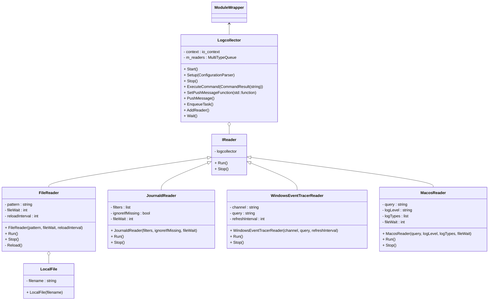

# Architecture

## Class Diagram

```mermaid
classDiagram
    class ModuleWrapper
    class Logcollector {
        - context : io_context
        - m_readers : MultiTypeQueue
        + Start()
        + Setup(ConfigurationParser)
        + Stop()
        + ExecuteCommand(CommandResult(string))
        + SetPushMessageFunction(std::function)
        + PushMessage()
        + EnqueueTask()
        + AddReader()
        + Wait()
    }
    class IReader {
        - logcollector
        + Run()
        + Stop()
    }
    class FileReader {
        - pattern : string
        - fileWait : int
        - reloadInterval : int
        + FileReader(pattern, fileWait, reloadInterval)
        + Run()
        + Stop()
        - Reload()
    }
    class LocalFile {
        - filename : string
        + LocalFile(filename)
    }
    class JournaldReader {
        - filters : list
        - ignoreIfMissing : bool
        - fileWait : int
        + JournaldReader(filters, ignoreIfMissing, fileWait)
        + Run()
        + Stop()
    }
    class WindowsEventTracerReader {
        - channel : string
        - query : string
        - refreshInterval : int
        + WindowsEventTracerReader(channel, query, refreshInterval)
        + Run()
        + Stop()
    }
    class MacosReader {
        - query : string
        - logLevel : string
        - logTypes : list
        - fileWait : int
        + MacosReader(query, logLevel, logTypes, fileWait)
        + Run()
        + Stop()
    }
    ModuleWrapper <-- Logcollector
    Logcollector o-- IReader
    IReader <|-- FileReader
    IReader <|-- JournaldReader
    IReader <|-- WindowsEventTracerReader
    IReader <|-- MacosReader
    FileReader o-- LocalFile
```
