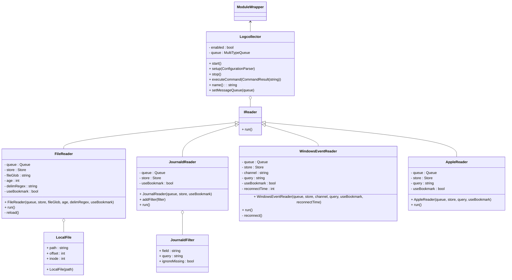

# Logcollector Module

## Introduction

Logcollector is the agent module that adds the ability to collect system logs,
both by reading plain text files and by collecting messages from the operating
system API.

## Settings

### Sample

```yaml
logcollector:
  enabled: true
  file:
    - location: /var/log/*.log
      age: 1d
      delim-regex: "\n"
      use-bookmark: true
  windows:
    reconnect-time: 5s
    use-bookmark: true
    - channel: Application
      query: Event[System/EventID = 4624]
    - channel: System
      query: Event[System/EventID = 7040]
  journald:
    - filter:
      - field: "_SYSTEMD_UNIT"
        query: ^ssh.service$
      - field: PRIORITY
        query: "[0-3]"
        ignore-missing: true
      use-bookmark: true
  macos:
    - query: process == "sshd" OR message CONTAINS "invalid"
      use-bookmark: true
```

### Reference

|Mandatory|Option|Description|Default|
|:-:|--|--|--|
||`enabled`|Sets the module as enabled.|yes|

#### File Collector

```yaml
- file:
```

The File collector handles plain-text log files.

|Mandatory|Option|Description|Default|
|:-:|--|--|--|
|✔️|`location`|Path to the file. Wildcards are supported.||
||`age`|Collect logs from files more recent than this parameter.|`0`|
||`delim-regex`|Regex to delimit logs within the file.|`\n`|
||`use-bookmark`|Whether the agent should jump to the latest line read on startup.|`yes`|

#### Journald Collector

```yaml
- journald:
```

This collector gets logs from Journald on Linux.

|Mandatory|Option|Description|Default|
|:-:|--|--|--|
||`filter`|(Array) Log matching criteria.||
||`use-bookmark`|Whether the agent should jump to the latest line read on startup.|`yes`|

##### filter

|Mandatory|Option|Description|Default|
|:-:|--|--|--|
|✔️|`field`|Name of the field.||
|✔️|`query`|Regex that the selected field in the log must match.||
||`ignore-missing`|Accept the log if the selected field is missing.|`yes`|

#### Windows Collector

```yaml
- windows:
```

This collector gets logs from the Windows Event Viewer.

|Mandatory|Option|Description|Default|
|:-:|--|--|--|
|✔️|`channel`|Log channel name.||
||`query`|Query string to filter logs. XPATH and QueryLists supported.|
||`use-bookmark`|Whether the agent should jump to the latest line read on startup.|`yes`|
||`reconnect-time`|Interval of reconnection attempts to the Windows Event API.|`5s`|

#### macOS (ULS) Collector

```yaml
- macos:
```

This collector gets logs from macOS through the Unified Logging System.

|Mandatory|Option|Description|Default|
|:-:|--|--|--|
||`query`|Query string to filter logs.|
||`use-bookmark`|Whether the agent should jump to the latest line read on startup.|`yes`|

## Class Diagram


