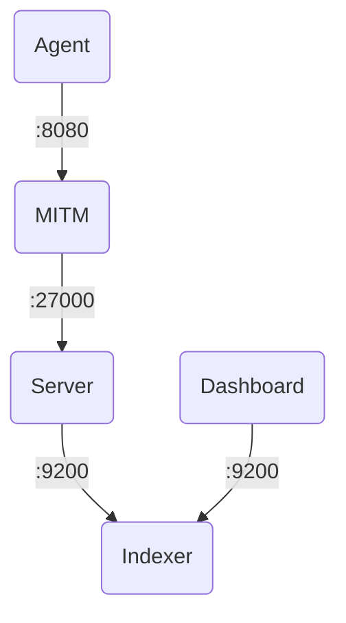

# Wazuh Stack Testing

## Introduction
This folder provides a Docker Compose environment for testing the complete Wazuh Stack, including all major components: Indexer, Dashboard, Server, and Agent. It is designed for easy setup and supports integration with locally built RPM packages, enabling end-to-end testing scenarios.

## Setup

1. Place the required RPM files for each component into their respective folders:
   - `wazuh-indexer*.rpm` into the _wazuh-indexer_ folder.
   - `wazuh-dashboard*.rpm` into the _wazuh-dashboard_ folder.
   - `wazuh-server*.rpm` into the _wazuh-server_ folder.
   - `wazuh-agent*.rpm` into the _wazuh-agent_ folder.

## Run

To start the stack, run the following command:

```shell
docker compose up
```

## Services

### Wazuh Dashboard

- URL: https://localhost:443

#### Settings

- Configuration file: `dashboard/opensearch_dashboards.yml`

#### Credentials

| User  | Password |
|-------|----------|
| admin | admin    |

### Wazuh Indexer

- URL: https://localhost:9200

#### Credentials

| User  | Password |
|-------|----------|
| admin | admin    |

- Certificates:
  - `/etc/wazuh-indexer/certs/admin.pem`
  - `/etc/wazuh-indexer/certs/admin-key.pem`

### Wazuh Server

- URLs:
  - Management API: https://localhost:55000
  - Comms API: https://localhost:27000

#### Settings

- Configuration file: `server/wazuh-server.yml`

#### Credentials

| User  | Password |
|-------|----------|
| wazuh | wazuh    |

### MITM Web

- URL: http://localhost:8081

### Wazuh Agent

#### Settings

- Configuration file: `agent/wazuh-agent.yml`

## Flowchart

The following flowchart illustrates the interaction between Wazuh Stack components:


